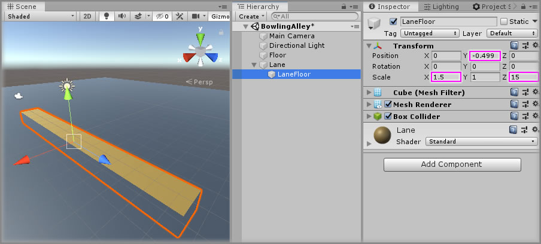
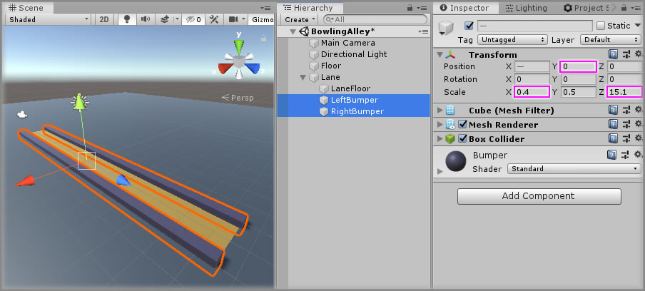
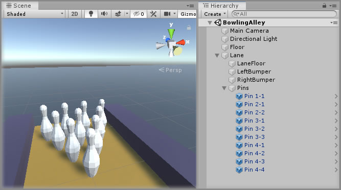
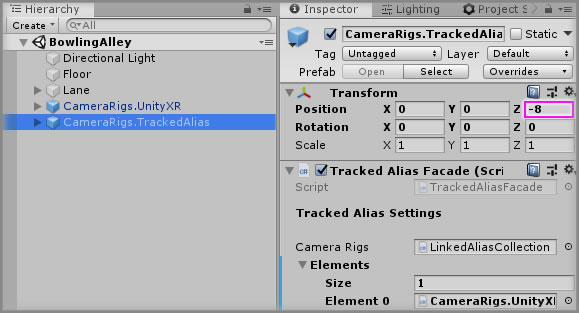
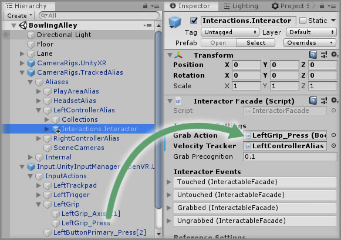
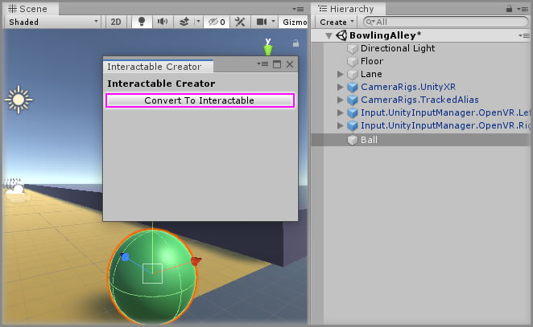
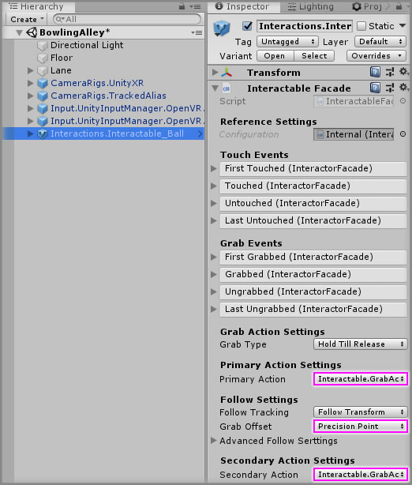
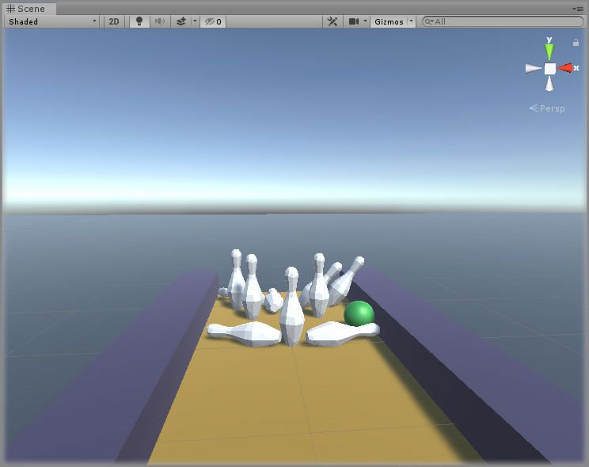

# Making A VR Bowling Game

> * Level: Intermediate
>
> * Reading Time: 15 minutes
>
> * Checked with: Unity 2019.2.18f1

## Introduction

A VR Bowling game is a very easy way to become accustomed to basic VR interactions.

In this tutorial we will set up a scene with a simple bowling alley and a VR CameraRig as well as an interactable ball that we can roll towards some collidable bowling pins.

The outcome of this tutorial is to teach the basics of how to set up a Unity scene for VR and how to interact with GameObjects with VR controllers.

## Prerequisites

* Create a new empty [Unity] project in Unity 2019.2.18f1 (or above).

## Let's Start

### Step 1

Let's start by creating a simple scene for our bowling alley.

Create a new `Cube` Unity 3D Object by selecting `Main Menu -> GameObject -> 3D Object -> Cube` and change the `Transform` properties to:

* Position: `X = 0, Y = -0.5, Z = 0`
* Scale: `X = 50, Y = 1, Z = 50`

Rename the new `Cube` to `Floor`.


Create a new material by selecting `Main Menu -> Assets -> Create -> Material` in the Unity software and name it `Floor`.

Change the `Albedo` property on the newly created `Floor` material to whatever color you want the floor to be, in the example project the `Floor` material has a hex value of `2C343C`.

Apply the `Floor` material to the `Floor` GameObject.

### Step 2

Now let's create a simple bowling alley lane. To start with, let's create an empty GameObject that can hold our lane GameObjects.

Create a new `Empty` GameObject by selecting `Main Menu -> GameObjet -> Create Empty` and ensure the `Transform` properties are defaulted to `0` for position and rotation, along with a uniform scale of `1`.

Rename the new `GameObject` to `Lane`.

Create a new `Cube` Unity 3D Object by selecting `Main Menu -> GameObject -> 3D Object -> Cube` and change the `Transform` properties to:

* Position: `X = 0, Y = -0.499, Z = 0`
* Scale: `X = 1.5, Y = 1, Z = 15`

Rename the new `Cube` to `LaneFloor` and drag and drop this GameObject to be a child of the `Lane` GameObject.

Create a new material by selecting `Main Menu -> Assets -> Create -> Material` in the Unity software and name it `Lane`.

Change the `Albedo` property on the newly created `Lane` material to whatever color you want the lane floor to be, in the example project the `Lane` material has a hex value of `9C7324`.

Apply the `Lane` material to the `LaneFloor` GameObject.



### Step 3

Finally, let's create some left and right lane bumpers to prevent our bowling ball leaving the lane too early.

Create a new `Cube` Unity 3D Object by selecting `Main Menu -> GameObject -> 3D Object -> Cube` and change the `Transform` properties to:

* Position: `X = -0.9, Y = 0, Z = 0`
* Scale: `X = 0.4, Y = 0.5, Z = 15.1`

Rename the new `Cube` to `LeftBumper` and drag and drop this GameObject to be a child of the `Lane` GameObject.

Create a new material by selecting `Main Menu -> Assets -> Create -> Material` in the Unity software and name it `Bumper`.

Change the `Albedo` property on the newly created `Bumper` material to whatever color you want the lane bumper to be, in the example project the `Bumper` material has a hex value of `332C46`.

Apply the `Bumper` material to the `LeftBumper` GameObject.

Now make a copy of the `LeftBumper` GameObject and rename the copy to be `RightBumper` and change the `Transform` properties of the `RightBumper` to:

* Position: `X = 0.9, Y = 0, Z = 0`



> [see commit #25e031e](https://github.com/ExtendRealityLtd/VRTK.Tutorials.VRBowling/commit/25e031e614346e3b88aaa5295b03f64443e1872f)

### Step 4

Now it's time to create our bowling pin. You can use any bowling pin model you wish, but for this tutorial we have a simple bowling pin mesh ready to use.

Download the [Bowling Pin mesh] and add it to your Unity project, preferably in a newly created directory in the `Unity/Assets` directory named `Models`.

Because the default bowling pin mesh is scaled differently to Unity's default scaling system, we'll need to change the model scale factor. So select the `BowlingPin` model in the Unity project window at `Assets/Models/BowlingPin` and change the `Scale Factor` property in the Unity Inspector to `7.8` then click `Apply`.


### Step 5

Drag and drop the `BowlingPin` model into the Unity scene and change the `Transform` properties to:

* Position: `X = 0, Y = 0, Z = 0`
* Rotation: `X = 0, Y = 0, Z = -90`
* Scale: `X = 1, Y = 1, Z = 1`

Next we need to make the bowling pin collidable within the Unity Physics system. To do this we need to add colliders and a rigidbody so Unity physics knows how to interact with it.

Select the `BowlingPin` GameObject within the Unity hierarchy and click the `Add Component` button and add a `Rigidbody` component.

Next we'll add a couple of colliders that roughly take the shape of the bowling pin.

> We could use a mesh collider that accurately wraps the shape of the bowling pin, but because the bottom of the bowling pin is slightly curved, this may make it difficult for the pin to stay upright in our scene.

First create a `Capsule Collider` and set the `Collider` properties to:

* Center: `X = 0.21, Y = 0, Z = 0`
* Radius: `0.08`
* Height: `0.575`
* Direction: `X-Axis`

Next create a `Box Collider` and set the `Collider` properties to:

* Center: `X = 0.465, Y = 0, Z = 0`
* Size: `X = 0.1, Y = 0.03, Z = 0.03`

> This `Box Collider` will ensure we have a nice and flat base for the bowling pin, so it stays up right until it is collided with.

Create a new material by selecting `Main Menu -> Assets -> Create -> Material` in the Unity software and name it `BowlingPin`.

Change the `Albedo` property on the newly created `BowlingPin` material to whatever color you want the bowling pin to be, in the example project the `BowlingPin` material has a hex value of `D4D4D4`.

Apply the `BowlingPin` material to the `BowlingPin` GameObject.

It is a good idea to turn our bowling pin into a prefab as we will have multiple bowling pins in the scene and if we want to make changes to the pin then changing the prefab will ensure the change affects all pins at the same time.

To turn our `BowlingPin` GameObject into a prefab, simply drag and drop the `BowlingPin` GameObject into the Unity Project `Assets` directory (preferably in a created sub directory named `Prefabs`).


> [see commit #292a11e](https://github.com/ExtendRealityLtd/VRTK.Tutorials.VRBowling/commit/292a11ed95ef5208427753fc5e5a0a9a62205f07)

### Step 6

We can now layout our bowling pin prefab into the standard ten pin formation. Let's start by creating an empty GameObject container to hold all of our pins.

Create a new child `Empty` GameObject by first selecting the `Lane` GameObject in the Unity Hierarchy then selecting `Main Menu -> GameObjet -> Create Empty Child` and then change the `Transform` properties to:

* Position: `X = 0, Y = 0.52, Z = 0`

Rename the new `GameObject` to `Pins`.

Now drag and drop `10` bowling pin prefabs into this new `Pins` GameObject and set each pin's `Transform` properties to:

* Pin 1:
  * Position: `X = 0, Y = 0, Z = 0`
* Pin 2:
  * Position: `X = -0.15, Y = 0, Z = 0.3`
* Pin 3:
  * Position: `X = 0.15, Y = 0, Z = 0.3`
* Pin 4:
  * Position: `X = -0.3, Y = 0, Z = 0.6`
* Pin 5:
  * Position: `X = 0, Y = 0, Z = 0.6`
* Pin 6:
  * Position: `X = 0.3, Y = 0, Z = 0.6`
* Pin 7:
  * Position: `X = -0.45, Y = 0, Z = 0.9`
* Pin 8:
  * Position: `X = -0.15, Y = 0, Z = 0.9`
* Pin 9:
  * Position: `X = 0.15, Y = 0, Z = 0.9`
* Pin 10:
  * Position: `X = 0.45, Y = 0, Z = 0.9`



> [see commit #2738635](https://github.com/ExtendRealityLtd/VRTK.Tutorials.VRBowling/commit/2738635d17179c4121aee434a8dbd4862cd9f2bb)

### Step 7

We're now going to start adding some VR enabled functionality to the scene. The first thing we need to do is include the Unity XR Legacy Input Helper package. You can do this via the [Unity Package Manager] or by simply updating the project `manifest.json` to include the following package:

```
"com.unity.xr.legacyinputhelpers": "2.0.6"
```

Switch back to the Unity software and wait for it to finish importing the added package.

> [see commit #3084c60](https://github.com/ExtendRealityLtd/VRTK.Tutorials.VRBowling/commit/3084c60f14f9824a9f591c2e1c917f2660cb94ee)

### Step 8

Now we need some custom Unity packages that bring in the VRTK functionality. All of the VRTK related packages are on [NPMJS] and we need to update our project `manifest.json` to point to the NPMJS scoped registry.

* Navigate to the `Packages` directory of your project.
* Adjust the [project manifest file][Project-Manifest] `manifest.json` in a text editor.
  * Ensure `https://registry.npmjs.org/` is part of `scopedRegistries`.
    * Ensure `io.extendreality` is part of `scopes`.

A minimal example ends up looking like this:

```json
{
  "scopedRegistries": [
    {
      "name": "npmjs",
      "url": "https://registry.npmjs.org/",
      "scopes": [
        "io.extendreality"
      ]
    }
  ],
  "dependencies": {
    ...
  }
}
```

> [see commit #dccf96a](https://github.com/ExtendRealityLtd/VRTK.Tutorials.VRBowling/commit/dccf96a4e5cc6b52fcb3ac42195dcd8493bd5f49)

### Step 9

We can now update our Unity project `manifest.json` to include our custom Unity packages and to start with we're going to include [Tilia.CameraRigs.UnityXR] and [Tilia.CameraRigs.TrackedAlias.Unity] which will give us the ability to put a VR CameraRig in our scene.

Update the `dependencies` section of our Unity project `manifest.json` to include the following lines:

```
"io.extendreality.tilia.camerarigs.trackedalias.unity": "1.0.7",
"io.extendreality.tilia.camerarigs.unityxr": "1.0.9",
```

Switch back to the Unity software and wait for it to finish importing the added packages.

> Full installation instructions for these packages can be found at the repository home pages at [Tilia.CameraRigs.UnityXR] and [Tilia.CameraRigs.TrackedAlias.Unity].

> [see commit #e5c1053](https://github.com/ExtendRealityLtd/VRTK.Tutorials.VRBowling/commit/e5c105342a3fe75da60ff6e75ada00be93902128)

### Step 10

Set up the Tilia UnityXR CameraRig and Tilia TrackedAlias in the scene by following the guides at:

* [Adding A UnityXR CameraRig]
* [Adding A Tracked Alias]

> You don't need to include the Tilia Simulated CameraRig as mentioned in the guides if you don't want to, in this tutorial we'll assume it hasn't been set up.

Make sure to delete the `Main Camera` from the Unity Hierarchy as the UnityXR CameraRig prefab already contains a `Main Camera`.

We also need to move the position of our `CameraRigs.TrackedAlias` GameObject so we start at the end of the bowling lane opposite to the bowling pin layout, so selected the `CameraRigs.TrackedAlias` GameObject and then change the `Transform` properties to:

* Position: `X = 0, Y = 0, Z = -8`



> [see commit #f7b5fe1](https://github.com/ExtendRealityLtd/VRTK.Tutorials.VRBowling/commit/f7b5fe1331550c9a4a43698b0218a27227e1c138)

### Step 11

We need to bring in some default Unity input mapping components to allow our VR controllers to work with the Unity Input Manager system. Tilia provides a simple Unity Input Manager package called [Tilia.Input.UnityInputManager] that will provide us everything we need.

First, let's bring that package into our Unity project by including it in our Unity project `manifest.json`. So update the `manifest.json` to contain the additional dependency:

```
"io.extendreality.tilia.input.unityinputmanager": "1.2.2",
```

Switch back to the Unity software and wait for it to finish importing the added package.

> Full installation instructions for this package can be found at the repository home page at [Tilia.Input.UnityInputManager].

Now we need to drag and drop some preconfigured input prefabs into the Unity scene that have the relevant button mappings for generic left and right OpenVR controllers.

Expand the `Tilia Input UnityInputManager` Package directory in the Unity Project window and then select `Packages -> Runtime -> Prefabs -> ControllerMappings`. For this example we are going to add the `Input.UnityInputManager.OpenVR.LeftController` prefab and the `Input.UnityInputManager.OpenVR.RightController`.

Drag and drop those two items into the Unity Scene.


> [see commit #a094259](https://github.com/ExtendRealityLtd/VRTK.Tutorials.VRBowling/commit/a094259dfd11d578097af7c03131945627d19ddc)

### Step 12

We need to add the Tilia Interations package to our project, which will give us the ability to add Interactors to our VR controllers. An interactor lets us touch and grab special interactable GameObjects that we can define in our scene, but for now let's just set up our Interactors by following the [Adding An Interactor] how-to guide.

It uses the Simulated CameraRig controls in the [Adding An Interactor] guide, but for our project we will update this to use our VR controller mappings we introduced in step 11.

We need to update our Interactors to listen to the Grip Button on our controller to grab the object. Expand `CameraRigs.TrackedAlias` and find the `Interactions.Interactor` GameObject in the `LeftControllerAlias` and `RightControllerAlias`.

For the `LeftControllerAlias`, Expand `CameraRigs.TrackedAlias -> Aliases -> LeftControllerAlias` and click on the `Interactions.Interactor` Gameobject.

Expand the `Input.UnityInputManager.OpenVR.LeftController -> Input Actions -> LeftGrip` and drag and drop the `LeftGrip_Press` GameObject onto the `Grab Action` parameter on the `Interactor Facade` component of the `CameraRigs.TrackedAlias -> Aliases -> LeftControllerAlias -> Interactions.Interactor` GameObject.



> Do the same with the right controller.

> [see commit #d0f09d0](https://github.com/ExtendRealityLtd/VRTK.Tutorials.VRBowling/commit/d0f09d00d696528ab26a6dc59f413a7e553e4d7e)

### Step 13

We now need an interactable bowling ball that we can pick up and throw down our virutal bowling alley.

Create a new `Sphere` Unity 3D Object by selecting `Main Menu -> GameObject -> 3D Object -> Sphere` and change the `Transform` properties to:

* Position: `X = 0, Y = 0.125, Z = -7.5`
* Scale: `X = 0.25, Y = 0.25, Z = 0.25`

Rename the new `Sphere` to `Ball`.

Create a new material by selecting `Main Menu -> Assets -> Create -> Material` in the Unity software and name it `Ball`.

Change the `Albedo` property on the newly created `Ball` material to whatever color you want the ball to be, in the example project the `Ball` material has a hex value of `278C35`.

Apply the `Ball` material to the `Ball` GameObject.

To make the ball interactbale, simply select the `Ball` GameObject in the Unity hierarchy and then open the `Tilia Interactable Creator` window by selecting `Main Menu -> Window -> Tilia -> Interactions -> Interactable Creator`.

Once the window is visible, just click on the `Convert To Interactable` button and the `Ball` GameObject will become nested inside a Tilia `Interactable` prefab.



We now need to configure our Interactable ball to determine what happens when we grab it with our VR controllers by touching it with our virtual controller avatars and pressing the controller grip buttons.

There are two actions that can occur when grabbing:

* The primary action is what happens when the first interactor attempts a grab on the interactable. In this case we want the ball to start following our VR controller to mimic it has been grabbed.
* The secondary action is what happens when an item is already being grabbed by a interactor and another interactor attempts to grab the interactable. In this case we simply want the grab to swap to the other VR controller.

Finally, we want to change how the ball attaches to the controller when grabbed. By default, the centre point of the ball (the origin) will snap to the centre point of the Interactor, but we want to make it feel a bit more precise so when we grab the ball, the point at which we grab it at is where we pick it up from.

To update these settings, select the `Interactions.Interactable_Ball` GameObject in the Unity hierarchy and change the following settings on the `Interactable Facade` component:

* Set the `Primary Action` parameter to `Interactable.GrabAction.Follow`.
* Set the `Grab Offset` parameter to `Precision Point`.
* Set the `Secondary Action` parameter to `Interactable.GrabAction.Swap`.



> [see commit #ecb255c](https://github.com/ExtendRealityLtd/VRTK.Tutorials.VRBowling/commit/ecb255c9203f0bccb0f79beae8cefaa28c8faba7)

### Step 14

If you now play the Unity scene and pick up the bowling ball by grabbing it then you'll be able to roll the ball down the lane towards the pins and upon collision the pins should fall over.

You may notice that the pins seem a little strong and the ball has little effect on knocking them down. To solve this problem we can just decrease the mass of the rigidbody on our bowling pin so the mass of the ball is heavier and therefore has an easier time of knocking them down.

Open the `BowlingPin` prefab and change the `Mass` property on the `Rigidbody` component to a smaller number such as `0.4`.

> [see commit #91ce884](https://github.com/ExtendRealityLtd/VRTK.Tutorials.VRBowling/commit/91ce884188755f6818feda73a4949897447cc0d7)

### Done

Now if you play the Unity scene, you'll be able to pick up the ball and roll it down the lane and try and get a strike!

The game is extremely simple at the moment with no way of resetting the pins or recalling the ball back for another roll.



[Unity]: https://unity3d.com/
[Bowling Pin mesh]: ../../../Assets/Models/BowlingPin.fbx
[Unity Package Manager]: https://docs.unity3d.com/Manual/upm-ui.html
[NPMJS]: https://www.npmjs.com/
[Project-Manifest]: https://docs.unity3d.com/Manual/upm-manifestPrj.html

[Tilia.CameraRigs.UnityXR]: https://github.com/ExtendRealityLtd/Tilia.CameraRigs.UnityXR
[Tilia.CameraRigs.TrackedAlias.Unity]: https://github.com/ExtendRealityLtd/Tilia.CameraRigs.TrackedAlias.Unity
[Adding A UnityXR CameraRig]: https://github.com/ExtendRealityLtd/Tilia.CameraRigs.UnityXR/blob/master/Documentation/HowToGuides/AddingAUnityXRCameraRig/README.md
[Adding A Tracked Alias]: https://github.com/ExtendRealityLtd/Tilia.CameraRigs.TrackedAlias.Unity/blob/master/Documentation/HowToGuides/AddingATrackedAlias/README.md

[Tilia.Input.UnityInputManager]: https://github.com/ExtendRealityLtd/Tilia.Input.UnityInputManager
[Adding An Interactor]: https://github.com/ExtendRealityLtd/Tilia.Interactions.Interactables.Unity/blob/master/Documentation/HowToGuides/AddingAnInteractor/README.md